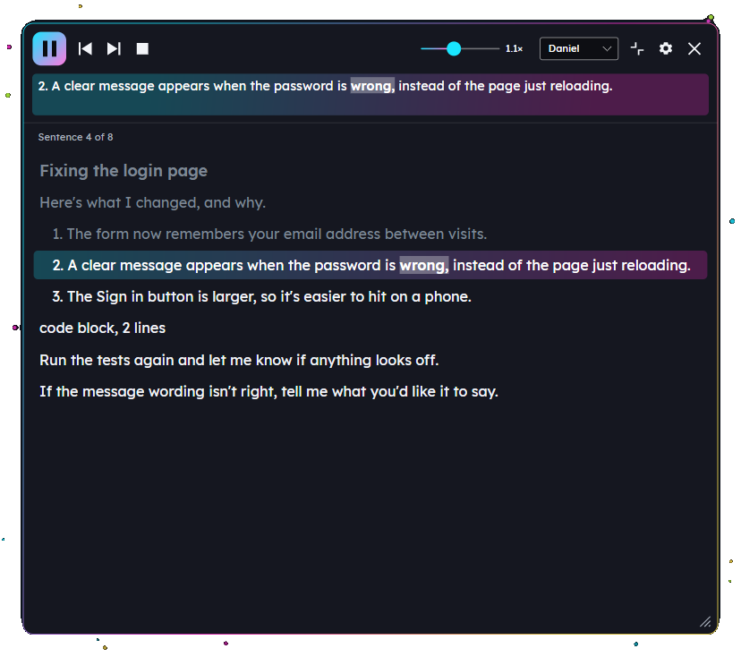
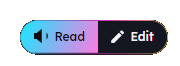
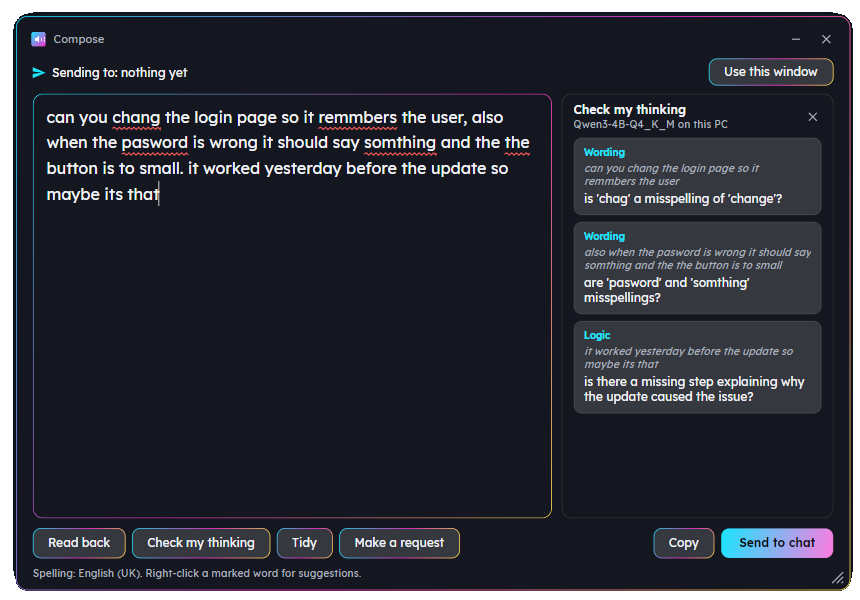
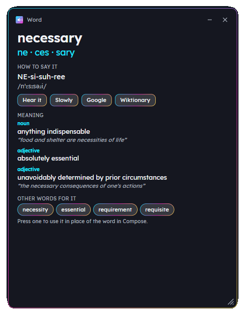

# Helpers

**Free tools that help you read, write and think things through, especially with AI.** Hear any text read aloud. Write back with confidence. Keep your text on your own PC.

[](https://github.com/drhumphrey/helpers/actions/workflows/build.yml)
[](LICENSE)




## Why

AI assistants are brilliant. Working with them means reading a lot of long text and typing a lot of careful requests. That's hard work when you're tired, short on time, not a natural typist, writing in a second language, or simply better at thinking out loud than putting thoughts in order on the page.

Helpers takes that strain off. It sits in the tray and helps in three ways:

- **Hear it.** Select any text and hear it read in a natural voice.
- **Write it.** Write your reply in a calm space with spelling help and a read-back.
- **Shape it.** Get a reader's notes on your draft: where it jumps, what's missing, what's unclear.

It's free. It works offline. Nothing leaves your PC unless you choose a cloud feature and give it your own key.

## What it does

### Hear it

Select text in any app. A small button appears next to your mouse. Press **Read**.



- Natural British voices that run on your own PC. Eight to choose from.
- Understands the Markdown AI chats produce. Code blocks, tables and symbols aren't read out letter by letter.
- Years, prices, times and percentages are said the way people say them.
- The player highlights each sentence and each word as it's spoken. Open it up to see the whole reply. Click any sentence to jump there.
- **Ctrl+Alt+Space** reads whatever is selected, from the keyboard.

### Write it

Press **Ctrl+Alt+C** in the app you're working in, or **Edit** on the Read button, and Compose opens.



- Spelling as you type, using Windows' own checker. Right-click for suggestions.
- **Read back** reads your draft to you. Hearing it catches the mistakes spell checkers can't, like "form" for "from".
- **Send to chat** pastes your draft into the chat box. It never presses Enter. You do that when you're ready.
- **Edit and Put it back.** Select your own half-written text anywhere, press Edit, fix it in Compose, then put it back where it came from.
- Drafts save themselves. Close Compose and nothing is lost.

### Shape it

Optional, and off until you choose an AI helper in Settings.

- **Check my thinking.** A careful reader's notes on your draft. Where does the logic jump? What does the reader need to know? Which "it" is this? Each note is a question or a tiny fix, pinned to your words. It never rewrites your text, so your voice stays yours.
- **Tidy.** Spelling and grammar only. Every change is marked. You apply them one at a time.
- **Make a request.** Turns rough notes into a clear request for a coding assistant.

Choose where the AI runs:

| | On this PC | Claude in the cloud |
|---|---|---|
| Cost | Free | Your own API key, usually less than a penny per use |
| Privacy | Nothing leaves your PC | Your draft goes to Anthropic when you press a button with the cloud mark |
| Speed | 10 to 20 seconds on a typical laptop | A few seconds |
| Download | 2.5 GB, once | None |

### Look up a word

Right-click any word in Compose and choose **Look up**.



- The word in syllables.
- How to say it, in plain letters and in IPA.
- Hear it, or hear it slowly.
- What it means, with an example.
- Other words for it. Press one to swap it in.

## Principles

- **Free for everyone.** No tiers, no paid extras, no selling AI credits. Ever.
- **Offline first.** The voice, the local AI and the dictionary run on your PC.
- **Private.** No telemetry, no crash reports. Your text is never logged. Update checks are off unless you switch them on.
- **Open source** under the GNU GPL v3.

## Install

1. Download the latest version from the [Releases page](https://github.com/drhumphrey/helpers/releases). Pick the installer (`Helpers-x.y.z-setup.exe`) or the zip.
2. Run it. The installer puts Helpers in your user folder. It doesn't need admin rights.
3. Windows may say "Windows protected your PC", because the app isn't signed yet. Choose **More info**, then **Run anyway**.
4. A welcome screen asks you to pick a voice. That's it.

Some parts download the first time you use them, then work offline:

| What | Size | When |
|---|---|---|
| The voice | 350 MB | First start |
| The dictionary for Look up | 10 MB | First Look up |
| The local AI model | 2.5 GB | When you choose "On this PC" |

**You'll need:** Windows 10 or 11, 64-bit. For spelling, Windows' English (United Kingdom) language features, which most UK PCs already have. For the local AI, a processor from the last ten years and about 5 GB of free memory while it runs.

## Privacy

Nothing phones home. The only things that ever use the internet:

- The one-off downloads above. Each one is checked against a checksum built into the app.
- Claude, if you choose it, when you press a button with the cloud mark. Your draft and the instructions for that button go to Anthropic. Nothing else.
- The update check, if you switch it on. Once a day it asks GitHub for the latest version number.

Your API key lives in Windows Credential Manager, never in a file. The app reads another app's text only when you press Read or Edit. Its keyboard hook can tell a key was pressed, never which one.

The full notes are in [docs/PRIVACY.md](docs/PRIVACY.md). Every component the app uses, with its licence, is in [docs/THIRD-PARTY-NOTICES.md](docs/THIRD-PARTY-NOTICES.md) and in Settings.

## Status

This is an early version. It works well on the PCs it has been tested on, and it will have rough edges.

**Done:** reading aloud, the Read button, the player, Compose, Send to chat, the AI helpers on your PC and on Claude, the word tools, settings, the installer.

**Next:**

- Code signing, so Windows stops warning.
- A browser extension, to put Read and Edit on the right-click menu in Chrome and Edge.
- A Mac version.
- A proper name. "Helpers" is a working title.

## Building from source

1. Install the [.NET 10 SDK](https://dotnet.microsoft.com/download).
2. From the repository root:

```
dotnet build Helpers.slnx
dotnet test Helpers.slnx
dotnet run --project src/Helpers.App
```

To make a release, push a tag such as `v0.2.0`. The Release workflow tests, publishes, builds the installer with Inno Setup, and attaches the installer, the zip and a version file to a GitHub release.

| Folder | What's in it |
|---|---|
| `src/Helpers.Core` | Everything that doesn't depend on Windows: text clean-up, Markdown, the sentence splitter, number reading, spelling logic, the AI prompts and notes, the word tools, settings. Fully unit-tested. |
| `src/Helpers.Speech` | The Kokoro voice through sherpa-onnx. |
| `src/Helpers.Ai` | The local model through LLamaSharp, and Claude through the Anthropic SDK. |
| `src/Helpers.Windows` | Windows-only parts: selection capture, hooks, the clipboard, the spell checker, Credential Manager. |
| `src/Helpers.App` | The Avalonia app: tray, Read button, player, Compose, Settings. |
| `tests/` | Unit tests. |
| `docs/` | The [brief](docs/BRIEF.md), the [design notes](docs/DESIGN.md), the [build log](docs/MILESTONES.md), privacy and licences. |
| `tools/` | Developer tools: `EngineSpike` checks the voice, `ReadingDump` prints what the reader would say for a file. |
| `prototype/` | The original AutoHotkey proof of concept. |

## Contributing

Help is very welcome, especially from people who find reading or writing hard work. Telling us what's hard to use is as valuable as code. See [CONTRIBUTING.md](CONTRIBUTING.md).

Found a security problem? Please read [SECURITY.md](SECURITY.md) and report it privately.

## Licence

Helpers is free software under the [GNU General Public License v3](LICENSE) or later. It comes with no warranty; see sections 15 and 16 of the licence. It's built on many other open-source projects, listed with their licences in [docs/THIRD-PARTY-NOTICES.md](docs/THIRD-PARTY-NOTICES.md).

Helpers is a general reading and writing tool. It isn't a medical device and doesn't diagnose or treat anything. AI notes can be wrong; you decide what to change.
